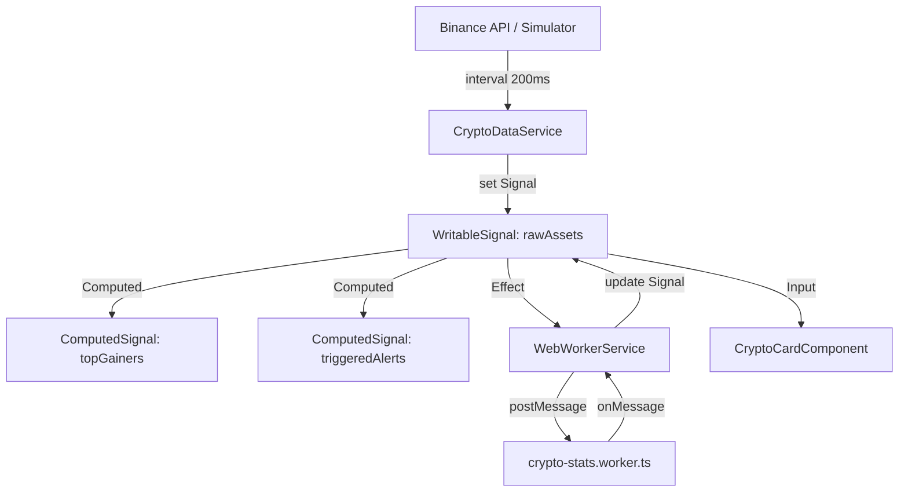

# Plan de Implementación: Monitor de Criptoactivos PRO (v2.0)

Este documento detalla la arquitectura técnica, el diseño visual y la estrategia de implementación para la plataforma de monitoreo de criptomonedas en tiempo real, utilizando **Angular 21**, **Signals**, y **Web Workers**.

## User Review Required

> [!IMPORTANT]
> Se ha incrementado la frecuencia de actualización a **200ms** para una experiencia de "ultra-alta frecuencia". Esto requiere el uso obligatorio de `ChangeDetectionStrategy.OnPush` en todos los componentes para evitar degradación de performance.

> [!WARNING]
> La integración con la API de Binance tiene un Rate Limit. El sistema implementa un **Simulador con Fallback Automático** que se activa si la API no responde o se excede el límite.

## Arquitectura del Sistema

### Flujo de Datos Reactivo
La aplicación sigue un flujo unidireccional impulsado por Signals.



## Proposed Changes

---

### [Component] Core & State Management

#### [MODIFY] [crypto-data.service.ts](file:///var/www/html/criptoactivos/src/app/core/services/crypto-data.service.ts)
Optimizar la gestión de estado para manejar volúmenes de datos más altos.
- Implementar `asReadonly()` para proteger la fuente de verdad.
- Añadir métodos de `pause/resume` para optimizar recursos cuando la pestaña no es visible.
- Mejorar la lógica de `updatePrices` para ser inmutable y eficiente (usando spread operators).

#### [NEW] [web-worker.service.ts](file:///var/www/html/criptoactivos/src/app/core/services/web-worker.service.ts)
Gestor de comunicación asíncrona.
- Métodos para inicializar el worker.
- Cola de mensajes para evitar saturación del canal.
- Suscripción a los resultados para actualizar el `CryptoDataService`.

---

### [Component] Web Worker Algorithms

#### [MODIFY] [crypto-stats.worker.ts](file:///var/www/html/criptoactivos/src/app/core/workers/crypto-stats.worker.ts)
Detalle de implementación de los cálculos estadísticos:

1.  **Promedio Móvil (SMA)**: 
    - Ventana deslizante configurable (por defecto 10 periodos).
    - `SMA = (P1 + P2 + ... + Pn) / n`
2.  **Volatilidad Progresiva**:
    - Cálculo de desviación estándar sobre el historial reciente.
    - `σ = √(Σ(xi - μ)² / n)`

---

### [Component] Models and Data Structures

#### [MODIFY] [crypto-asset.model.ts](file:///var/www/html/criptoactivos/src/app/core/models/crypto-asset.model.ts)
Definición exhaustiva de la interfaz de dominio:

```typescript
export interface CryptoAsset {
  id: string;               // 'BTC', 'ETH', etc.
  name: string;             // 'Bitcoin'
  symbol: string;           // 'BTC'
  price: number;            // Valor flotante (64-bit)
  previousPrice: number;    // Para animaciones Delta
  changePercent: number;    // Computed en service
  priceHistory: number[];   // Buffer circular (N=20)
  alertThreshold?: number;  // Nullable
  isAlertTriggered: boolean;// Flag visual
  movingAverage?: number;   // Inyectado por Worker
  volatility?: number;      // Inyectado por Worker
  lastUpdate: number;       // Unix Timestamp (ms)
}
```

---

### [Component] UI/UX & Design System

#### [MODIFY] [styles.css](file:///var/www/html/criptoactivos/src/styles.css)
Definición de tokens de diseño premium:

| Token | Valor (HEX/RGBA) | Propósito |
|-------|------------------|-----------|
| `--bg-primary` | `#0a0e27` | Fondo ultra oscuro |
| `--accent-green` | `#00ff88` | "Success" y subida de precio |
| `--accent-red` | `#ff4757` | "Alert" y bajada de precio |
| `--glass-bg` | `rgba(255, 255, 255, 0.05)` | Efecto translúcido |
| `--glass-border` | `rgba(255, 255, 255, 0.1)` | Borde sutil para tarjetas |

#### [MODIFY] [crypto-card.component.html](file:///var/www/html/criptoactivos/src/app/features/crypto-monitor/components/crypto-card/crypto-card.component.html)
Estructura semántica mejorada:
- Uso de `<article>` para accesibilidad.
- Implementación de la nueva sintaxis de control de flujo de Angular (`@if`, `@else`).
- Integración de `appHighlightChange` en el contenedor de precio.

---

### [Component] Directivas y Pipes

#### [NEW] [highlight-change.directive.ts](file:///var/www/html/criptoactivos/src/app/features/crypto-monitor/directives/highlight-change.directive.ts)
- Detector de cambios de `Input`.
- Aplica clases CSS dinámicas (`flash-green`, `flash-red`).
- Limpieza automática de clases con `setTimeout`.

---

---

## Seguridad y Optimización Avanzada

### Seguridad de los Datos
- **Sanitización de Inputs**: Validación estricta de los umbrales de alerta para evitar `NaN` o valores negativos.
- **ReadOnly Signals**: Exposición de los datos mediante `asReadonly()` para evitar que componentes externos muten el estado global accidentalmente.

### Optimizaciones de Rendimiento
- **Zone.js Optimization**: Considerar el uso de `provideExperimentalZonelessChangeDetection()` en `app.config.ts` para reducir la carga de detección de cambios global.
- **Worker Throttle**: El Web Worker procesa datos solo cuando hay cambios significativos en el historial para ahorrar ciclos de CPU en el fondo.
- **Memory Management**: El historial de precios (`priceHistory`) se maneja como un buffer circular de tamaño fijo (max 20) para evitar fugas de memoria por crecimiento infinito.

---

## Plan de Verificación

### Pruebas Automatizadas

#### Unit Tests - Services
```bash
# Ejecutar tests de servicios core
ng test --include=src/app/core/services/*.spec.ts
```
- **Verificar**: Que el `CryptoDataService` emita valores cada 200ms exactos.
- **Verificar**: Que los `computed` signals se actualicen sólo cuando el ID relevante cambia.

#### Web Worker Validation
- Simular un historial de precios `[10, 20, 30, 40, 50]` y verificar que el worker devuelva `SMA = 30`.

### Verificación Manual

1.  **Estrés de UI**: Abrir la pestaña de "Performance" en Chrome y validar que el "Main Thread" se mantiene por debajo del 15% de uso incluso con actualizaciones de 200ms.
2.  **Sistema de Alertas**:
    - Configurar Bitcoin con umbral de `$40,000`.
    - Forzar el precio a `$40,001` mediante la consola/simulador.
    - **Resultado**: La tarjeta debe volverse roja instantáneamente y mostrar el badge de alerta.
3.  **Responsive Check**: Probar en iPhone 12 Pro (viewport 390x844) y asegurar que el grid de tarjetas se apila correctamente (`display: grid` con `grid-template-columns: repeat(auto-fit, ...)`).

---

## Roadmap de Implementación

1.  **Fase 1: Infraestructura Core** (Día 1)
    - Definición de Interfaces y Modelos.
    - Implementación del `CryptoDataService` con el simulador inicial.
2.  **Fase 2: Procesamiento Background** (Día 1)
    - Desarrollo del Web Worker.
    - Integración del `WebWorkerService`.
3.  **Fase 3: Componentes y Estética** (Día 2)
    - Desarrollo de `CryptoCard` y `CryptoMonitor`.
    - Aplicación del "Glassmorphism" y animaciones.
4.  **Fase 4: Pulido y Verificación** (Día 2)
    - Implementación de Alertas dinámicas.
    - Batería de tests y optimización final.

```
Hecho con precisión técnica para el Monitoreo de Criptoactivos.
```
