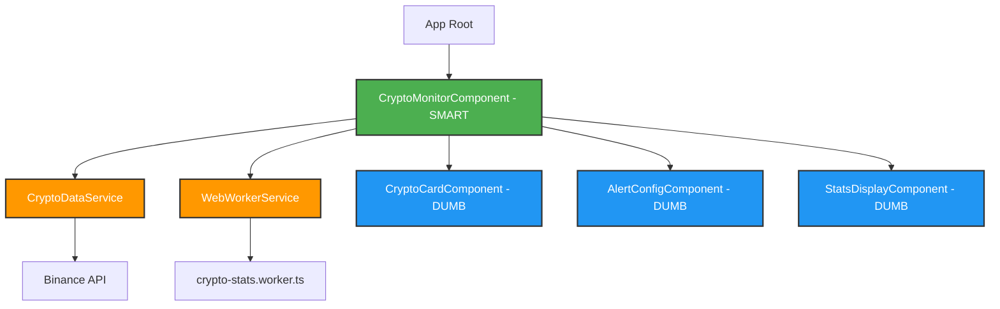
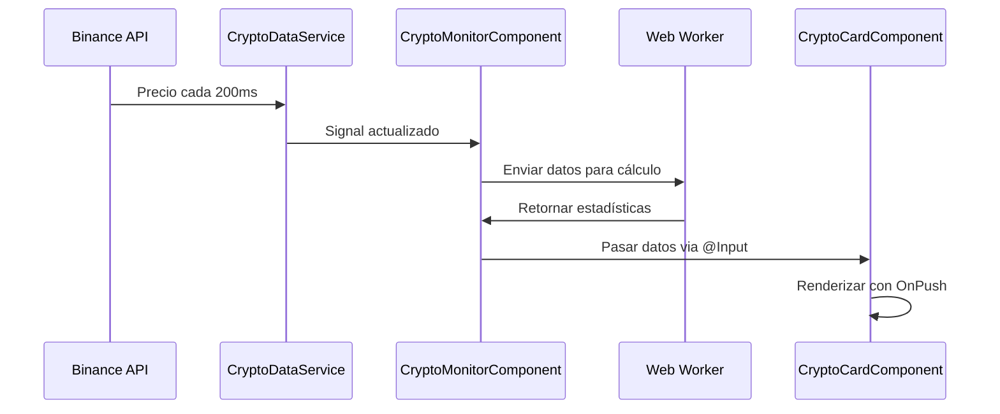

>

# Plataforma de Monitoreo de Criptoactivos en Tiempo Real (Master Complete V2)

## Descripción General

Construiremos una aplicación Angular 21 moderna que monitorea precios de criptomonedas en tiempo real, utilizando las últimas características de Angular incluyendo Signals para state management reactivo, Web Workers para cálculos estadísticos sin bloquear la UI, y directivas personalizadas para animaciones visuales. La aplicación será visualmente impresionante con un diseño premium en modo oscuro.

## Contexto Técnico

- **¿Por qué Signals?** Los Signals son el nuevo sistema de reactividad de Angular que reemplaza RxJS en muchos casos. Son más eficientes porque solo actualizan lo que realmente cambió, como un "observador inteligente" que solo avisa cuando hay cambios reales.
- **¿Por qué Web Workers?** Los cálculos estadísticos (promedio móvil, volatilidad) son operaciones pesadas. Si las ejecutamos en el hilo principal, la UI se "congela". Un Web Worker es como contratar un asistente que hace los cálculos en segundo plano mientras la UI sigue respondiendo.
- **¿Por qué directivas personalizadas?** Las directivas nos permiten "enseñarle" nuevos trucos al HTML. En este caso, crearemos una que detecta cambios de precio y aplica animaciones automáticamente.

---

## Arquitectura de la Aplicación

### Patrón: Smart/Dumb Components (Container/Presentational)



**Explicación Feynman:**

- **Smart Components (verde):** Son como el "cerebro" - toman decisiones, manejan datos, se comunican con servicios.
- **Dumb Components (azul):** Son como "pantallas tontas" - solo muestran lo que les dicen, no piensan por sí mismos.
- **Services (naranja):** Son como "proveedores de datos" - traen información de APIs o hacen cálculos.

---

## Flujo de Datos



1.  **Binance API:** Envía precio cada 200ms.
2.  **CryptoDataService:** Actualiza el Signal.
3.  **CryptoMonitorComponent:** Detecta el Signal actualizado.
4.  **Web Worker:** Recibe datos para cálculo y retorna estadísticas.
5.  **CryptoCardComponent:** Recibe datos via @Input y renderiza con OnPush.

---

## Estructura de Carpetas

```text
src/
├── app/
│   ├── core/                          # EL CEREBRO Y LAS REGLAS
│   │   ├── services/
│   │   │   ├── crypto-data.service.ts      # Proveedor de datos en tiempo real
│   │   │   └── web-worker.service.ts       # Gestión de Web Workers
│   │   ├── models/
│   │   │   ├── crypto-asset.model.ts       # Interfaces TypeScript
│   │   │   └── stats-result.model.ts
│   │   └── workers/
│   │       └── crypto-stats.worker.ts      # Worker para cálculos
│   │
│   ├── features/
│   │   └── crypto-monitor/            # Feature module principal
│   │       ├── components/
│   │       │   ├── crypto-monitor/         # SMART: Container principal
│   │       │   ├── crypto-card/            # DUMB: Tarjeta de cripto
│   │       │   ├── alert-config/           # DUMB: Configuración de alertas
│   │       │   └── stats-display/          # DUMB: Mostrar estadísticas
│   │       └── directives/
│   │           └── highlight-change.directive.ts  # Directiva de animación
│   │
│   ├── shared/                        # Componentes y utilidades compartidas
│   │   ├── pipes/
│   │   │   └── currency-format.pipe.ts
│   │   └── utils/
│   │       └── price-simulator.ts
│   │
│   ├── app.ts                         # Componente raíz
│   ├── app.html
│   ├── app.css
│   └── app.routes.ts
│
└── styles.css                         # Estilos globales
```

---

## Cambios Propuestos y Especificaciones

### 1. Core Services

#### `crypto-data.service.ts`

- **Responsabilidad:** Gestionar el feed de precios en tiempo real usando RxJS y Signals.
- **Características:** Integración con Binance API (https://api.binance.com/api/v3/ticker/price), actualización cada 200ms, simulación de fluctuaciones realistas.
- **Manejo de Activos:** BTC, ETH, BNB, SOL, ADA, XRP.

#### `web-worker.service.ts`

- **Responsabilidad:** Comunicación con Web Worker para cálculos estadísticos.
- **Características:** Inicialización del worker, envío de historial de precios, recepción de resultados.

#### `crypto-stats.worker.ts`

- **Responsabilidad:** Ejecutar SMA y Volatilidad en segundo plano.
- **Algoritmos:**
  - SMA = (P1 + P2 + ... + Pn) / n
  - σ = √(Σ(xi - μ)² / n)
- **Feynman:** // Un promedio móvil es como calcular tu nota promedio de los últimos 5 exámenes en lugar de todos. Te da una idea más reciente de tu rendimiento.

### 2. Models

#### `crypto-asset.model.ts`

```typescript
export interface CryptoAsset {
  id: string; // Identificador único (ej: 'BTC')
  name: string; // Nombre completo (ej: 'Bitcoin')
  symbol: string; // Símbolo (ej: 'BTC')
  price: number; // Precio actual en USD
  previousPrice: number; // Precio anterior (para detectar cambios)
  changePercent: number; // Cambio porcentual
  priceHistory: number[]; // Historial para cálculos
  alertThreshold?: number; // Umbral de alerta definido por usuario
  isAlertTriggered: boolean; // Si se superó el umbral
  movingAverage?: number; // Promedio móvil calculado por worker
  volatility?: number; // Volatilidad calculada por worker
}
```

### 3. Smart Component: `crypto-monitor.component.ts`

- **Responsabilidad:** Orquestar toda la lógica.
- **State Management:**

```typescript
readonly rawAssets = signal<CryptoAsset[]>([]);
readonly topGainers = computed(() => {
  return this.rawAssets()
    .filter(asset => asset.changePercent > 5)
    .sort((a, b) => b.changePercent - a.changePercent);
});
readonly triggeredAlerts = computed(() => {
  return this.rawAssets().filter(asset => asset.isAlertTriggered);
});
```

### 4. Directiva de Animación: `highlight-change.directive.ts`

```typescript
@Directive({
  selector: '[appHighlightChange]',
  standalone: true,
})
export class HighlightChangeDirective implements OnChanges {
  @Input() currentPrice!: number;
  @Input() previousPrice!: number;

  // Feynman: Esta directiva observa el precio anterior y el actual, aplicando un flash verde o rojo.
  // Es como un parpadeo en un marcador deportivo cuando anotas.
}
```

---

## 5. Paso a Paso de la Implementación (El Manual)

### PASO 1: Los Modelos (El Contrato)

Definimos la interfaz `CryptoAsset` para asegurar consistencia. TypeScript grita si algo falta.

### PASO 2: El Web Worker (El Ayudante del Sótano)

Imagina que eres un Chef (Hilo Principal). Envías las papas pesadas (cálculos) al ayudante del sótano para no dejar de cocinar (UI fluida).

### PASO 3: CryptoDataService (El Corazón Reactivo)

Uso de Signals: antes Angular preguntaba puerta por puerta si algo cambió. Con Signals, el precio es como una alarma que suena solo donde interesa.

### PASO 4: Componentes Smart/Dumb

- **Smart (Manager):** Tiene el teléfono, llama a servicios, toma decisiones.
- **Dumb (Mesero):** Solo lleva el plato a la mesa. No decide los ingredientes.

---

## 6. Visual Design & Styling

### Paleta Moderna

```css
:root {
  --bg-primary: #0a0e27;
  --accent-green: #00ff88;
  --accent-red: #ff4757;
  --glass-bg: rgba(255, 255, 255, 0.05);
}
```

### Animaciones Flash

```css
@keyframes flash-green {
  50% {
    background-color: rgba(0, 255, 136, 0.3);
  }
}
.flash-green {
  animation: flash-green 0.5s ease-in-out;
}
```

### Glassmorphism

Efecto `backdrop-filter: blur(10px)` con bordes sutiles y sombras profundas para un look premium.

---

## 7. Plan de Verificación

### Pruebas Automatizadas

1.  **Unit Tests - Services:** Validar actualización de signal cada 200ms.
2.  **Unit Tests - Worker:** Validar cálculos de SMA y Volatilidad.
3.  **Unit Tests - Directive:** Validar clases 'flash-green' y 'flash-red'.

### Manual Verification

1.  **Visual:** Actualizaciones fluidas sin lag.
2.  **Alertas:** Configurar umbral y confirmar cambio visual de tarjeta.
3.  **Worker:** Confirmar en DevTools que no hay "Long Tasks" (>50ms).
4.  **Responsive:** Validar en mobile y desktop.

---

## 8. Performance Benchmarks

- **FPS:** 60fps constantes.
- **Latencia:** <16ms por frame.
- **CPU:** <30% en el main thread.

## 9. Resumen de Entregables

✅ Aplicación Angular funcional con 5+ criptomonedas.
✅ Actualizaciones cada 200ms sin bloquear UI.
✅ Sistema de alertas dinámicas.
✅ Web Workers para cálculos.
✅ Diseño premium moderno.

---

Hecho con ❤️ y Angular Signals para Criptoactivos.
